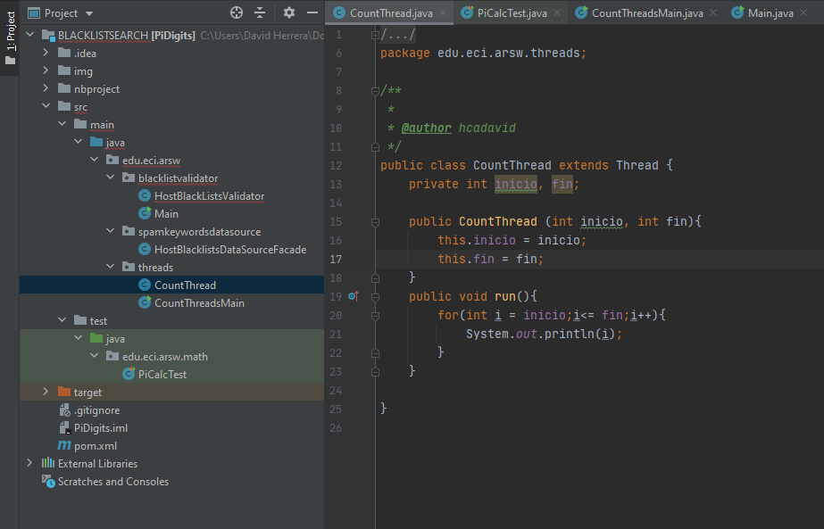
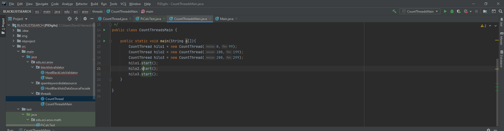
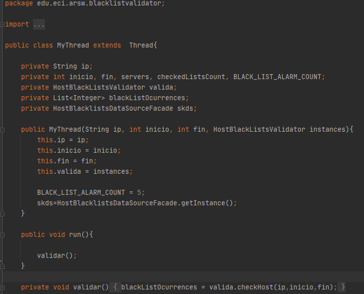
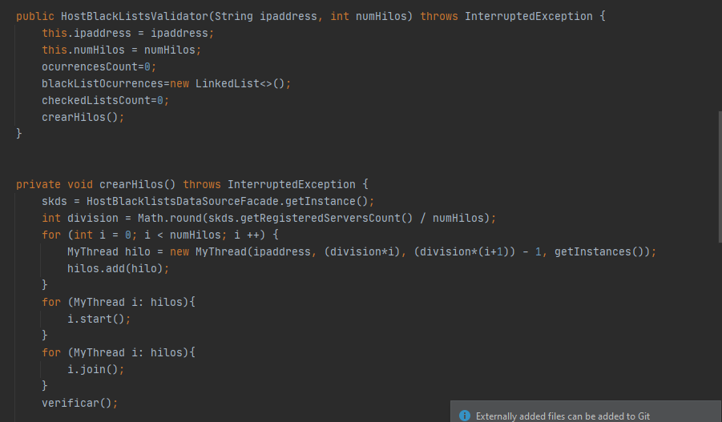
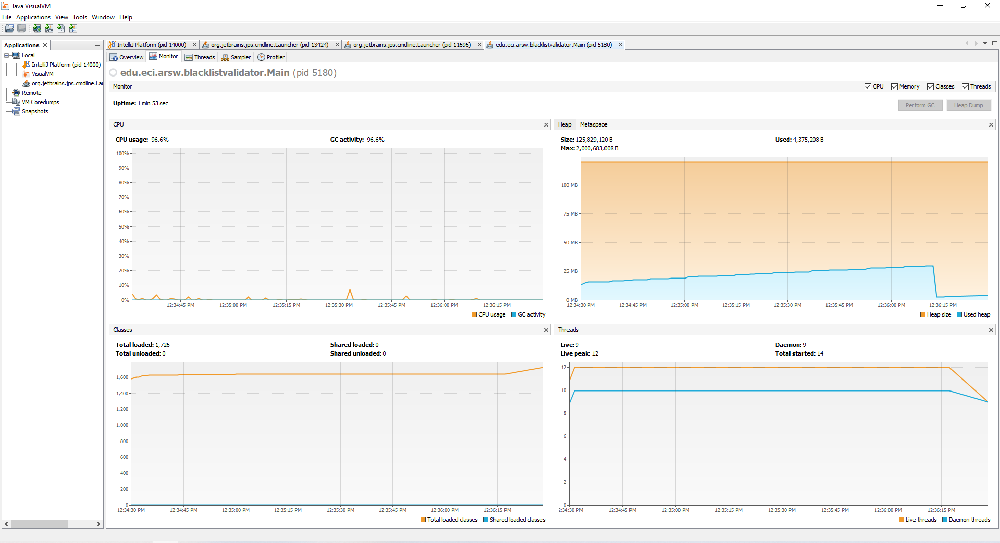
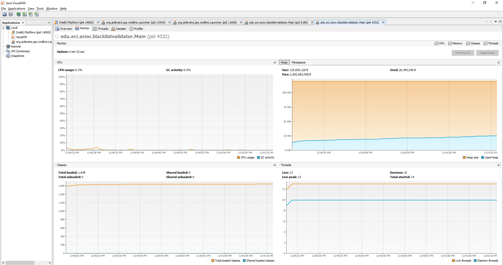
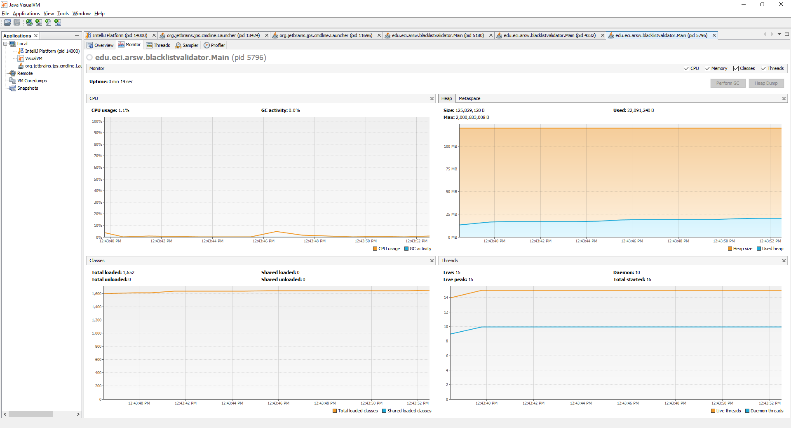
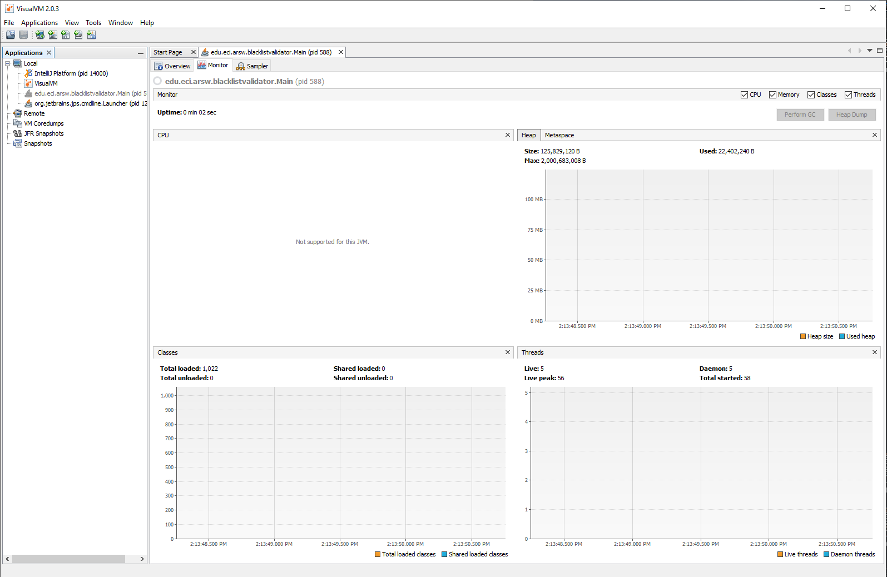

# Part I - Introduction to threads in JAVA
1. In agreement with the lectures, complete the classes CountThread, so that they define the life cycle of a thread that prints the numbers between A and B on the screen.

2. Complete the main method of the CountMainThreads class so that: 
- Create 3 threads of type CountThread, assigning the first interval [0..99], the second [99..199], and the third [200..299]. 

- Start the three threads with start(). Run and check the output on the screen. 

.png)

- Change the beginning with start() to run(). How does the output change? Why?

.png)

.png)

La diferencia radica principalmente en que cuando se usa el metodo star() se realiza paralelismo y cuando se usa run() un hilo se essjecuta despues del otro.

# Part II - Black List Search Exercise 

1. Create a Thread class that represents the life cycle of a thread that searches for a segment of the pool of available servers. Add to that class a method that allows you to ask the instances of it (the threads) how many occurrences of malicious servers it has found or found.

2. Paralelism

Nosotros en el contructor de la clase agregamos un parametro qeu va a definir la cantidad de hilos
en que se va a paralelizar el problema, esto con el fin de usar la cantidad de hilos en toda la clase de ser necesario.

# Part III - Discussion

En el momento de que encuentre el numero de ocurrencias podemos detener la ejecución de los hilos
de tal manera que ya la busqueda no se siga llevando a cabo.

# Part IV - Performance Evaluation

From the above, implement the following sequence of experiments to perform the validation of dispersed IP addresses (for example 202.24.34.55), taking the execution times of them (be sure to do them on the same machine):

1. Analisis del proceso usando solo 1 hilo.

2. Analisis del proceso usando 2 hilos

3. Analisis del proceso usando 4 hilos.

4. Analisis del proceso usando 100 hilos, se pudo apreciar que al momento de hacerlo con 50
hilos es el mismo desempeño que con 100 hilos.

