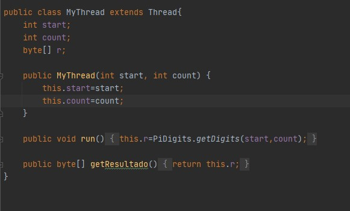
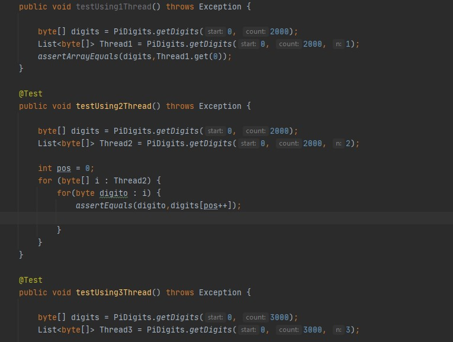
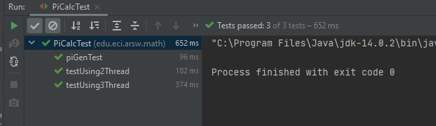

# PiDigits
- Esta formula se encarga de calcular el Nesimo digito del numero
Pi en base 16.
El objetivo de esta parte del laboratorio es hacer uso de esta formula
utilizando el paralelismo y el multithreading:

Este nuevo metodo se encarga de realizar las divisiones de procesos que va a realizar cada hilo.

Teniendo en cuenta que cada hilo usa el metodo de PiDigits que venia en la plantilla de la siguiente manera:

Tambien se realizaron prubeas, en donde se usa el metodo qeu funciona en la clase piDigits y se compara con el metodo que se creo
y estos fueron los resultados:

