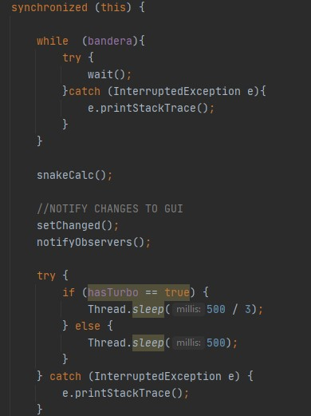
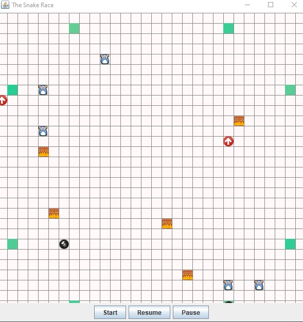
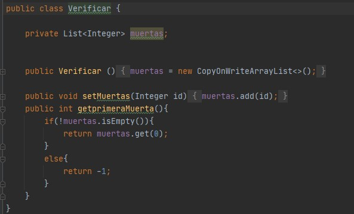
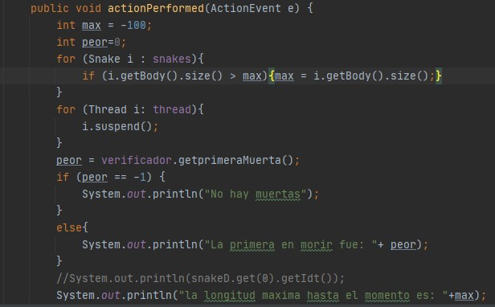

# Part 3

1. Identify critical regions associated with race conditions, and do something in order to eliminate them.Note that you have to synchronize strictly needed. In the answers document suggest the solution proposed for each item of the point 2. As the same way note that you don´t have to add more race conditions

Sincronizamos dentro del metodo run, creando una bandera, para notificar a los otros hilos que ya pueden proceder a utilizar el recurso.
2. dentify critical regions associated with race conditions, and do something in order to eliminate them.Note that you have to synchronize strictly needed. In the answers document suggest the solution proposed for each item of the point 2. As the same way note that you don´t have to add more race conditions:

Indentificamos estas regiones criticas ya que estos son los metodos que 
acceden al unico recurso compartido que es el tablero

3. As you can see, the game is incomplete. Write code in order to implement functionallities through buttons in the GUI to start / Pause / Resume the game: start the game if it has not started, Pause the game if it is on, Resume the game if it is suspended. Keep in mind:

Creamos los botones Pause y Resume, teniendo en cuenta que se pausó solo se puede resumir y si se resumio solo se puede pausar.

Creamos una clase verificar para poder realizar el proceso de imprimir la primera serpiente que murió:

En el listener del boton pause, se hizo todo el proceso de usar la clase verificardor, para poder imprimir la peor serpiente tal y como se muestra acontinuacion.
Tambien se implementó la funcionalidad de la serpiente mas larga:

Algo que añadir es que se modificó el constructor para que la snake reciba el verficación.